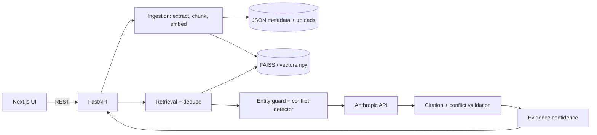

# ◈ DocuSense AI
**Investigate documents. Follow the evidence.**

An evidence-grounded multi-document investigation workspace. Upload PDFs, DOCX and TXT files, ask questions, and get answers
that link back to exact pages and quotes, with conflicts between sources surfaced instead of hidden, and an explicit
"insufficient evidence" outcome instead of a guess.

> Status: **backend complete and tested; UI is a deliberately basic first pass** (functional, minimal styling) so the
> full premium UI can be designed next on a proven API.

## Features
- Upload (multi-file), PDF/DOCX/TXT/MD extraction with page numbers, section-aware chunking
- Real ingestion stages with measured timings (uploading, extracting, chunking, embedding, indexing)
- Semantic retrieval (MiniLM + FAISS), de-duplicated and diversified across documents
- Grounded answers via an LLM using forced structured output, then **server-side validation** of every citation and conflict
- Deterministic **conflict detection** (e.g. 12 vs 16 weeks) that never picks a winner
- **Insufficient-evidence** handling, and "evidence confidence" (high/medium/low) computed from retrieval signals
- Search, recent investigations (persisted), save/unsave, stats, health, one-click NovaTech demo workspace

## Architecture


## AI pipeline
1. **Retrieve**: embed the question, search the index within the chosen scope, drop hits under the relevance threshold, de-duplicate, cap chunks per document.
2. **Guard**: capitalised terms in the question (e.g. "Mars") that appear nowhere in the retrieved evidence mark the question as unsupported. This is a simple, transparent heuristic, not a classifier.
3. **Conflicts (deterministic)**: sentences from *different* documents stating the same unit of quantity with different values and near-identical surrounding text are clustered into a conflict.
4. **Generate**: the LLM must answer only from numbered evidence blocks via a forced tool call (answer, citations, conflicts, insufficient flag).
5. **Validate**: citations must reference real evidence; quotes must appear verbatim in the cited chunk, otherwise they are replaced by a real sentence from that chunk (`quote_verified=false`). LLM conflict claims are checked against the evidence and dropped if unsupported. Dangling `[n]` markers are removed.
6. **Confidence**: `low` if insufficient/uncited/below threshold; `medium` if sources conflict (conflict caps at medium); otherwise by top retrieval score; never higher than the LLM's own rating. It is a label for evidence strength, not a probability.

**Extractive mode:** with no `ANTHROPIC_API_KEY`, the API still works but returns quoted sentences from the evidence instead of a written answer. Responses say `meta.mode = "extractive"` and the UI labels it.

## Setup
```bash
# backend
cd backend
python -m venv .venv && source .venv/bin/activate
pip install -r requirements.txt
cp .env.example .env            # add ANTHROPIC_API_KEY
uvicorn app.main:app --reload   # http://localhost:8000/docs

# frontend (new terminal)
cd frontend
cp .env.example .env.local
npm install && npm run dev      # http://localhost:3000
```
First run with `sentence-transformers` downloads `all-MiniLM-L6-v2` (needs internet once). Open the app, click **Load NovaTech demo workspace**.

## API
| Method | Path | Purpose |
|---|---|---|
| GET | `/health` | status, embedder, index, LLM configured |
| POST | `/documents/upload` | multipart `files` (multiple); per-file result + stage timings |
| GET / GET / DELETE | `/documents`, `/documents/{id}`, `/documents/{id}` | list, detail with chunks, delete |
| POST | `/questions` | investigate: `{question, top_k?, min_score?, document_ids?, collection?}` |
| POST | `/search` | exact + semantic search with page/snippet |
| GET | `/conflicts`, `/stats` | corpus-wide conflicts; real counts |
| GET / PATCH / DELETE | `/investigations[/{id}]` | history; `PATCH {saved}` to save |
| POST | `/demo/load` | index the five NovaTech documents |

## Testing
```bash
cd backend && python -m pytest        # or: python -m unittest discover -s tests -t .
```
Covers extraction (real generated PDF + DOCX + TXT, corrupt/empty/unsupported), chunking, embeddings/index (persistence, deletion), retrieval, citation snapping, LLM conflict validation, LLM failure, insufficient evidence, scope filtering, and the demo scenarios (12 vs 16 weeks; Mars refusal). API tests run when FastAPI is installed.

## Deployment
- **Frontend → Vercel**: root `frontend/`, env `NEXT_PUBLIC_API_URL=https://<backend>`.
- **Backend → Render / Railway / Fly.io**: root `backend/`, build `pip install -r requirements.txt`, start `uvicorn app.main:app --host 0.0.0.0 --port $PORT`; set `ANTHROPIC_API_KEY`, `CORS_ORIGINS=https://<your-vercel-app>`.
- **Storage caveat:** data is on the local filesystem (JSON + vectors). Most platforms have **ephemeral disks**, so attach a persistent volume mounted at `DATA_DIR` or accept that data resets on redeploy. This is not production-grade storage; `app/store.py` and `app/index.py` are the two seams to replace with object storage / a database.
- Memory: `sentence-transformers` needs roughly 500 MB+ RAM; use a plan with room, or set `EMBEDDING_BACKEND=hashing` (lexical, lower quality).

## Security
Filenames sanitised; extension allow-list; upload size cap; files stored under generated ids and never executed; secrets only in `.env`; the API key never reaches the browser; no stack traces returned. There is **no authentication**: do not expose a public instance with sensitive documents.

## Known limitations
- Conflict detection is deterministic only for **quantities with units**; other contradictions rely on the LLM (validated, but best-effort).
- The unsupported-entity guard only catches capitalised terms; a vague unanswerable question may still return low-relevance evidence (confidence will be low).
- TXT/DOCX page numbers are estimated unless the TXT uses form-feed page breaks (`page_basis` reports which).
- Scanned PDFs have no OCR and are rejected with a clear message.
- Single-process JSON storage: fine for a demo, not for concurrent multi-user use.
- The UI is a first pass: no collections UI, document viewer, insights page, settings page, command palette or dark/light toggle yet.

## Future work
Premium UI (shell, command palette, evidence viewer, conflict comparison), collections, insights charts, OCR, object storage, auth, streaming answers, evaluation set for retrieval quality.

## AI / API disclosure
Answers are generated by an Anthropic Claude model through the Anthropic API when `ANTHROPIC_API_KEY` is set. Embeddings use `all-MiniLM-L6-v2` (sentence-transformers). This codebase was written with AI assistance. The NovaTech documents are fictional.
