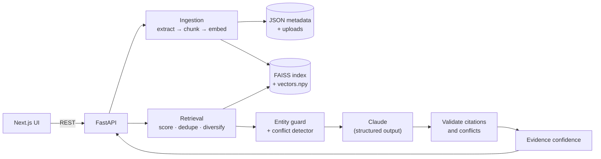

<div align="center">

# ◈ DocuSense AI

### Investigate documents. Follow the evidence.

**DocuSense doesn't just answer. It shows you why.**


<!-- Replace with a real screenshot or GIF once you record one -->


</div>

---

## The problem

Ask a chatbot about your company's documents and you get a confident paragraph with no way to check it. Worse, when two documents **disagree**, it quietly picks one.

DocuSense is built around the opposite idea:

| Typical RAG chatbot | DocuSense |
|---|---|
| Fluent answer, vague sources | Every claim links to **document, page, section and quote** |
| Silently merges contradictions | **Surfaces conflicts** and refuses to pick a winner |
| Guesses when it doesn't know | Returns **"insufficient evidence"** instead |
| "Trust me" confidence | **Evidence confidence** based on retrieval signals, not vibes |
| Trusts whatever the model says | **Validates** every citation and conflict against the source text |

## Try it in 5 easy steps

No documents of your own needed. DocuSense comes with a fake company called **NovaTech** so you can see everything working right away.

**Step 1: Start the app**
Open two terminals and run one command in each (full setup is in [Quick start](#quick-start)):

```bash
# Terminal 1
cd backend && uvicorn app.main:app --reload --port 8000

# Terminal 2
cd frontend && npm run dev
```

Then open **http://localhost:3000** in your browser.

**Step 2: Load the demo**
Click the **Load NovaTech demo workspace** button. After a few seconds, 5 documents are ready.

**Step 3: Ask a question that has a conflict**
Click the suggested question, or type it:

> What is the parental leave policy?

You will see:
- an answer that says the documents **disagree**
- a **Conflict** card: the Handbook says **12 weeks**, the HR Policy says **16 weeks**
- an **Evidence** panel on the right showing the exact pages and quotes

DocuSense will not pick a winner for you. It shows you both sources.

**Step 4: Check the proof**
Click any blue **[1]** or **[2]** in the answer. The matching evidence card lights up. That is how you verify the answer yourself.

**Step 5: Ask something it cannot know**

> What is NovaTech's policy for employees working on Mars?

DocuSense answers **"Insufficient evidence"** with low confidence and no made-up sources. A normal chatbot would guess here.

That's the whole idea: **answers you can check, conflicts you can see, and honesty when the documents don't say.**

**Want to use your own files?** Go to **Documents**, drag in PDF, Word or text files, wait for the green check, then go back and ask away.

---

## Features

- **Multi-document ingestion**: PDF, DOCX, TXT/MD, multi-file upload, page-aware extraction, honest per-stage timings
- **Semantic retrieval**: `all-MiniLM-L6-v2` embeddings + FAISS, de-duplicated and diversified across documents
- **Grounded answers**: the LLM is forced into structured output and may only use the numbered evidence it is given
- **Citation validation**: invented quotes are caught and replaced with real text from the cited chunk
- **Conflict detection**: deterministic detection of contradicting quantities (e.g. 12 vs 16 weeks) plus LLM-found conflicts that are verified before display
- **Uncertainty handling**: insufficient-evidence outcome, an unsupported-entity guard, and capped confidence when sources disagree
- **Investigation workspace**: answer card, confidence badge, clickable citations, evidence panel with relevance scores
- **Conflicts page**, document search, document management, persisted recent investigations, save/unsave
- **Cinematic UI layer**: a live 3D evidence constellation, orbiting loading animation, tilt-and-glare evidence cards, page transitions (respects reduced-motion)
- **Safe by default**: sanitised filenames, type allow-list, upload cap, secrets only in `.env`, no stack traces to users

## Architecture



## How an investigation works

```text
Question
  │
  ├─ 1  Embed question, search FAISS within scope, apply relevance threshold
  ├─ 2  De-duplicate and cap chunks per document for source diversity
  ├─ 3  Guard: named terms (e.g. "Mars") that appear nowhere in the evidence → insufficient
  ├─ 4  Detect conflicts: same unit, different value, same sentence shape, different documents
  ├─ 5  LLM answers from numbered evidence only (forced tool call, temperature 0)
  ├─ 6  Verify: quotes must exist in the cited chunk, conflict claims must exist in the evidence
  └─ 7  Confidence: low / medium / high. Conflicts can never score high.
```

**Evidence confidence is not a probability.** It describes how strongly the retrieved evidence supports the answer.

No API key? The API still works in a clearly labelled **extractive mode** that quotes the evidence instead of writing an answer. It never fakes AI output.

## Quick start

```bash
# 1. Backend
cd backend
python -m venv .venv
source .venv/Scripts/activate      # macOS/Linux: source .venv/bin/activate
pip install -r requirements.txt
cp .env.example .env               # add ANTHROPIC_API_KEY
python -m pytest                   # run the test suite
uvicorn app.main:app --reload --port 8000

# 2. Frontend (new terminal)
cd frontend
cp .env.example .env.local
npm install
npm run dev                        # http://localhost:3000
```

Check `http://localhost:8000/health`. You want `embedding.semantic: true` and `llm.configured: true`. The first run downloads the MiniLM model.

## Configuration

| Variable | Default | Purpose |
|---|---|---|
| `ANTHROPIC_API_KEY` | none | Enables LLM-written answers (backend only) |
| `ANTHROPIC_MODEL` | `claude-sonnet-5-5` | Model used for answers |
| `EMBEDDING_BACKEND` | `auto` | `auto`, `sentence-transformers`, or `hashing` (lexical fallback) |
| `TOP_K` | `6` | Evidence chunks per question |
| `MIN_SCORE` | embedder default | Relevance threshold override |
| `DATA_DIR` | `./data` | Where documents, metadata and the index live |
| `MAX_UPLOAD_MB` | `25` | Upload size cap |
| `CORS_ORIGINS` | `http://localhost:3000` | Allowed frontend origins |

## API

| Method | Path | Purpose |
|---|---|---|
| `GET` | `/health` | Status, embedder, index, LLM configured |
| `POST` | `/documents/upload` | Multi-file upload with per-file results and stage timings |
| `GET` `DELETE` | `/documents`, `/documents/{id}` | List, inspect (with chunks), delete |
| `POST` | `/questions` | Run an investigation |
| `POST` | `/search` | Exact + semantic search with page and snippet |
| `GET` | `/conflicts`, `/stats` | Corpus-wide conflicts and real counts |
| `GET` `PATCH` `DELETE` | `/investigations[/{id}]` | History, save, remove |
| `POST` | `/demo/load` | Index the NovaTech demo documents |

Interactive docs at `http://localhost:8000/docs`.

## Tech stack

**Backend**: Python, FastAPI, Pydantic, sentence-transformers, FAISS, pypdf, python-docx, scikit-learn, Anthropic API
**Frontend**: Next.js 14, React, TypeScript, canvas-based 3D, plain CSS
**Storage**: local filesystem with JSON and a persisted vector index, behind small interfaces (`store.py`, `index.py`) so they can be swapped for object storage or a database

## Testing

```bash
cd backend && python -m pytest
```

Covers extraction (real generated PDF, DOCX and TXT, plus corrupt, empty and unsupported files), chunking, index persistence and deletion, retrieval and scoping, citation snapping, rejection of invented LLM claims, LLM failure handling, the 12-vs-16-week conflict, the Mars refusal, and the HTTP API.

## Honest limitations

- Deterministic conflict detection covers **quantities with units**. Other contradictions depend on the LLM, whose claims are verified but best-effort.
- The unsupported-entity guard only catches capitalised terms. Vague unanswerable questions rely on relevance scores.
- DOCX and TXT page numbers are **estimated** unless a TXT uses form-feed page breaks. PDF pages are real.
- Scanned PDFs are rejected: there is no OCR.
- There is **no authentication**. Don't expose a public instance with private documents.
- Local-disk storage suits a demo and a single instance, not multi-user production. Most hosts need a persistent volume.

## Roadmap

- [x] Ingestion, retrieval, grounded answers, citations, conflicts, insufficient evidence
- [x] Basic workspace UI with 3D visuals and loading animation
- [ ] App shell: collapsible sidebar, header, command palette (`⌘K`)
- [ ] Side-by-side conflict comparison view
- [ ] Document viewer with highlighted evidence
- [ ] Collections, insights charts, settings, light/dark toggle
- [ ] OCR, authentication, object storage, streaming answers

## AI & API disclosure

Answers are generated by an Anthropic Claude model through the Anthropic API when a key is configured. Embeddings come from `all-MiniLM-L6-v2` (sentence-transformers). This project was built with AI assistance. All NovaTech and Acme documents are fictional.

---

<div align="center">

**Trust + intelligence + evidence + precision.**

</div>